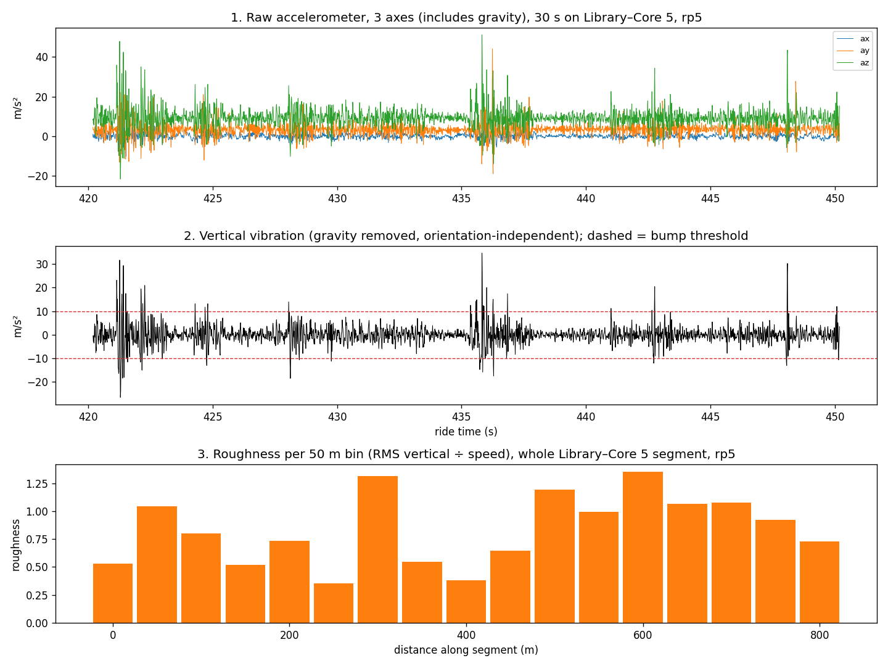

# Processing report

Generated by `python src/run_all.py`. Every number below is recomputed from `data/raw/`.

## Per-ride data flow

Stages: raw samples → trimmed (15 s around starts/pauses; 4 s on rp6) → map-matched (≤ 30 m from reference route) → moving (≥ 1.5 m/s).

| ride          | direction   |   accel_hz |   accel_samples_raw |   gps_fixes_raw |   gps_fixes_kept |   pauses |   after_trim |   after_map_match |   moving_ge_1_5ms | status                                                  |
|:--------------|:------------|-----------:|--------------------:|----------------:|-----------------:|---------:|-------------:|------------------:|------------------:|:--------------------------------------------------------|
| rp2_0926_1647 | ret         |      100.4 |              104788 |            1046 |             1037 |        5 |        92685 |             92685 |             92685 | used                                                    |
| rp3_0927_1146 | out         |      100.3 |              138857 |            1385 |             1378 |        6 |       123748 |            121139 |            121088 | used                                                    |
| rp4_0927_1218 | ret         |        0.5 |                 681 |            1391 |             1344 |        7 |          nan |               nan |               nan | excluded: accelerometer < 50 Hz (GPS used as reference) |
| rp5_0927_1407 | out         |      100.3 |              125459 |            1273 |             1236 |        5 |       110411 |            108454 |            108453 | used                                                    |
| rp6_0927_1433 | ret         |      100.3 |              111675 |            1177 |             1059 |       21 |        96057 |             96057 |             95297 | used                                                    |

## Outputs

- 50 m bins: 111 canonical bins, 322 ride×bin rows from 4 rides
- Bump hotspots: 88 total, 55 confirmed in ≥ 2 rides
- Photos: 23 photos at 15 spots; 15 within 25 m of a hotspot, 11 at confirmed hotspots

## Segment roughness

| segment                       |   rides |   mean_roughness |   std_across_rides |   length_m |   confirmed_hotspots |
|:------------------------------|--------:|-----------------:|-------------------:|-----------:|---------------------:|
| Library–Core 5                |       3 |            0.849 |              0.026 |        850 |                   12 |
| New SAC–Library               |       4 |            0.543 |              0.069 |        700 |                   10 |
| Faculty market–Serpentine     |       4 |            0.529 |              0.057 |        950 |                   13 |
| Serpentine–New SAC            |       3 |            0.51  |              0.067 |        800 |                    8 |
| Library–Brahmaputra (direct)  |       1 |            0.496 |            nan     |        800 |                    0 |
| Core 5–Brahmaputra (backside) |       3 |            0.466 |              0.026 |       1450 |                   12 |

